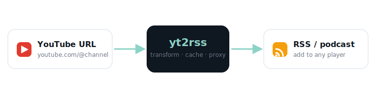

<p align="center">
  
</p>

<h1 align="center">Youtube to RSS</h1>

A hosted tool that converts YouTube URLs into podcast URLs.
This means I can watch my favourite YouTubers on a plane or in a crowded underground train.

<p align="center">
  
</p>

## Quick

Copy/paste Youtube URL on `https://nas.local:2777/`,
then add the converted URL into your podcast player.

Enjoy!

## Howto

Copy/paste Youtube URL like `https://youtube.com/...` to `https://nas.local:2777/...`

Some Podcast player can dislike `@`,
so use `https://nas.local:2777/_user/...`
instead of `https://nas.local:2777/@...`.

Otherwise read the API on `https://nas.local:2777/docs`

## Install

The simplest way is Docker Compose (spins up the app plus a memcached cache):

```bash
docker compose up -d --build
```

The feed data is persisted in `./_DATA`.

### Manual run

```bash
docker build -t yt2rss:latest .

docker network create my_vnet
docker run --name memlocal --network my_vnet \
  --memory=64M \
  --detach \
  memcached:1-alpine
docker run --name yt2rss --network my_vnet --publish 2777:8000 \
  --volume ./_DATA:/data \
  --env YT2RSS_CACHE_MODE="memcache" \
  --env YT2RSS_MEMCACHE_HOST="memlocal" \
  --env YT2RSS_CHANNEL_TTL="3666" \
  --detach \
  yt2rss:latest
```

## Configuration

All settings are optional environment variables.

| Variable | Default | Description |
| --- | --- | --- |
| `YT2RSS_CACHE_MODE` | `disk` | Cache backend: `disk`, `memcache` or `none`. |
| `YT2RSS_MEMCACHE_HOST` | `memcached` | Memcache host (when `CACHE_MODE=memcache`). |
| `YT2RSS_MEMCACHE_PORT` | `11211` | Memcache port. |
| `YT2RSS_CHANNEL_TTL` | `600` | Channel/playlist listing cache TTL (seconds). |
| `YT2RSS_VIDEO_TTL` | `3600` | Per-video metadata cache TTL (signed URLs expire). |
| `YT2RSS_MAX_ITEMS` | `10` | Number of items per feed. |
| `YT2RSS_MAX_HEIGHT` | `720` | Preferred video height. |
| `YT2RSS_MAX_VIDEO_BYTES` | `0` | Max bytes the `/video` proxy streams/stores per request (`0` = unlimited). |
| `YT2RSS_CORS_ORIGINS` | `*` | Comma-separated allowed origins. |
| `YT2RSS_LOG_LEVEL` | `ERROR` | Log verbosity. |
| `YT2RSS_MDNS_ENABLED` | `false` | Advertise the instance on the LAN over mDNS. |
| `YT2RSS_MDNS_NAME` | `yt2rss` | mDNS service instance name. |
| `YT2RSS_MDNS_TYPE` | `_http._tcp.local.` | mDNS service type. |
| `YT2RSS_MDNS_PORT` | `8000` | Port advertised in the mDNS record. |

## LAN discovery (mDNS / DNS-SD)

Set `YT2RSS_MDNS_ENABLED=true` and yt2rss will announce itself on the local
network as an `_http._tcp` service, so other machines and services can find it
without knowing its IP. Discover it from any LAN host:

```bash
# Linux (avahi)
avahi-browse -rt _http._tcp
# macOS
dns-sd -B _http._tcp
```

The service advertises the port from `YT2RSS_MDNS_PORT` and a `path=/` property.

> In Docker, mDNS multicast does not cross the default bridge network. To
> announce on the physical LAN, run the container with host networking, e.g.
> `docker run --network host -e YT2RSS_MDNS_ENABLED=true ... yt2rss:latest`.
> If the feature cannot start (no multicast), yt2rss logs a warning and keeps
> serving normally.

## Tests

```bash
pip install -r requirements-dev.txt
pytest
```

The suite stubs out `yt-dlp`, so it runs fully offline.

Linting and formatting use [ruff](https://docs.astral.sh/ruff/):

```bash
ruff check .
ruff format --check .
```

## Browser extension

A companion extension (`subcRiSS`) generates the feed URL from any YouTube
page in one click. See [`subcRiSS/readme.md`](subcRiSS/readme.md).

**Download** (Firefox, Chrome, Edge):

- from the [GitHub Releases](../../releases) page, or
- straight from your running server — the homepage footer links to
  `/extra/extensions/subcRiSS/{firefox,chrome,edge}.zip`.
